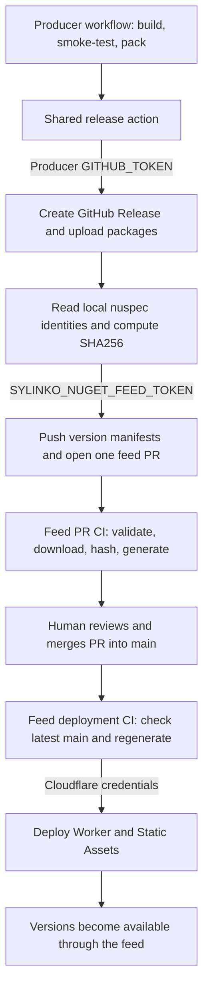
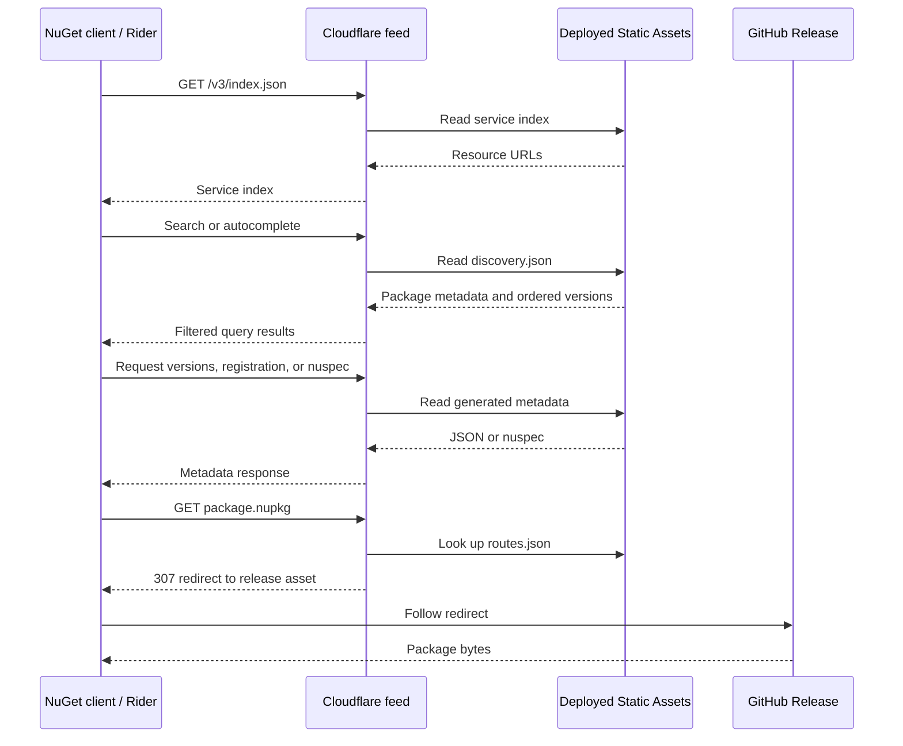

# Sylinko NuGet Feed

Public NuGet v3 feed for Sylinko-maintained fork packages and public internal packages.

```bash
dotnet nuget add source https://nuget.sylinko.com/v3/index.json --name Sylinko
```

Package repositories build the binaries. This repository reviews their release manifests and generates the feed. Cloudflare serves the generated metadata; GitHub Releases stores the package files.

## Where each part lives

| Part | Authoritative location | Purpose |
| --- | --- | --- |
| Source and packaging workflow | Producer repository | Build, smoke-test, and pack a release |
| `.nupkg` and optional symbol packages | Producer's public GitHub Release | Distribute the exact package bytes |
| Package registration and version manifests | This repository's `bucket/` | Record approved IDs, provenance, artifact URLs, and SHA256 hashes |
| NuGet indexes, registrations, nuspec files, and download routes | Generated from manifests and verified packages | Rebuildable output deployed as Cloudflare Static Assets |
| HTTP routing | `worker/src/index.ts` | Serve assets and redirect package downloads |

Neither package binaries nor generated metadata are committed to this repository. The runtime does not fetch metadata from GitHub raw. Each publication deploys the Worker together with the newly generated Static Assets.

## Publishing a package batch



A successful producer release is only the first stage. **A version becomes available through this feed after its feed PR is merged and deployment succeeds.**

### 1. Register each package once

Before the producer's first publication, merge a `bucket/<lowercase-package-id>/package.yml` into this repository's `main`. Register every package in the batch, including companion packages such as annotations or analyzers.

For example:

```yaml
id: Microsoft.ML.Tokenizers
lowerId: microsoft.ml.tokenizers
source:
  repository: Sylinko/Microsoft.ML
policy:
  requireSylinkoPrefix: false
  allowOriginalPackageId: true
```

Preserve original package IDs where dependency compatibility requires them. The release action checks the package identity and that `source.repository` matches the calling repository. The policy fields document registration intent; they should not be mistaken for a complete authorization mechanism.

Registration alone publishes no version. The action creates `versions/<lowercase-version>.yml` after packages have been built.

### 2. Configure credentials

| Credential | Where the workflow reads it | Purpose |
| --- | --- | --- |
| Automatic `github.token` / `GITHUB_TOKEN` | Producer workflow run | Create the producer's GitHub Release and upload its assets; the publishing job needs `contents: write` |
| `SYLINKO_NUGET_FEED_TOKEN` | Producer repository Actions secret, or an organization Actions secret shared with that repository | Push a branch and create a PR in `Sylinko/nuget-feed` |
| `CLOUDFLARE_ACCOUNT_ID` | Feed repository Actions secrets | Select the deployment account |
| `CLOUDFLARE_API_TOKEN` | Feed repository Actions secrets | Deploy the Worker and Static Assets |

`SYLINKO_NUGET_FEED_TOKEN` is a secret name chosen by our workflows, not a NuGet API key or a Cloudflare credential. Its authority comes from the GitHub identity and permissions of the stored token. A fine-grained PAT for this purpose should target `Sylinko/nuget-feed` with Contents and Pull requests write access, subject to organization approval rules. Producers do not need Cloudflare credentials.

The source code cannot establish who issued the currently configured token, its expiration date, or whether repository or organization secrets supply it. Inspect those settings in GitHub. Reusing a secret name does not prove that repositories store the same token.

#### Creating `SYLINKO_NUGET_FEED_TOKEN`

1. Open your GitHub account's **Settings → Developer settings → Personal access tokens → Fine-grained tokens → Generate new token**. Give it a recognizable name and expiration date.
2. Set **Resource owner** to the owner of the feed repository (`Sylinko`). The token's account must already have the required access. If organization approval is required, wait until approval is complete.
3. Under **Repository access**, choose **Only select repositories**. A combined publishing credential can select `Sylinko/nuget-feed` and the current producer repository, for example `Sylinko/Microsoft.ML` or `Sylinko/Porta.Pty`. Add other producer repositories explicitly if the same credential is intentionally shared.
4. Under **Repository permissions**, configure:

   | Permission | Access | Used for |
   | --- | --- | --- |
   | Metadata | Read-only (automatically required) | Read repository metadata |
   | Contents | Read and write | Check out repositories and push the feed release branch; also release uploads if a workflow explicitly uses this PAT for them |
   | Pull requests | Read and write | Read/create the batch publication PR in the feed repository |

   Write access includes read access. No Packages permission is required: binaries live in GitHub Releases, and this feed does not publish to GitHub Packages. The shared action does not edit workflow files, so it does not require Workflows write access.
5. Generate the token and copy its value into the producer repository's **Settings → Secrets and variables → Actions → New repository secret**, named exactly `SYLINKO_NUGET_FEED_TOKEN`. Alternatively, create an organization Actions secret and grant access to only the intended producer repositories. Configure the Actions secret on the producer, where `${{ secrets.SYLINKO_NUGET_FEED_TOKEN }}` is evaluated; adding it only to the feed repository does not make it available to producers.
6. Pass that secret to the action's `token` input. Separately, give the producer publishing job's automatic `GITHUB_TOKEN` `contents: write` permission.

**Current action's minimum scope:** it uses the supplied PAT only for `Sylinko/nuget-feed`; it uses the automatic `GITHUB_TOKEN` for the producer's release. Therefore selecting both repositories is supported but is not required by this action. If you want the smallest PAT scope, select only the feed. A fine-grained PAT has one resource owner, so it cannot cover a producer owned by another account/organization in the same token; the current two-token arrangement still works in that case.

The PAT's selected repositories control where it can act. The repository/organization Actions secret configuration controls which workflows can receive it. Both must be configured. Branch protection and organization policies still apply; token permissions do not bypass them.

On expiration or rotation, replace the Actions secret in each producer or update the shared organization secret. GitHub cannot show the existing secret value, and this repository cannot determine its issuer or expiration from the secret name. See [GitHub's PAT setup instructions](https://docs.github.com/en/authentication/keeping-your-account-and-data-secure/managing-your-personal-access-tokens) and [Actions secrets](https://docs.github.com/en/actions/how-tos/write-workflows/choose-what-workflows-do/use-secrets).
### 3. Build and call the shared action

The producer owns build, smoke tests, and `dotnet pack`. Pass a directory containing only the intended release batch to the action. Normal package assets should be named `<PackageId>.<Version>.nupkg`; optional symbols use matching `.snupkg` or `.symbols.nupkg` names.

Inside the producer's publishing job, after packing:

```yaml
# The publishing job also needs: permissions: { contents: write }
- uses: Sylinko/nuget-feed@v1
  with:
    token: ${{ secrets.SYLINKO_NUGET_FEED_TOKEN }}
    release-tag: nuget/MyPackage/${{ steps.version.outputs.version }}
    artifacts-directory: artifacts
```

`steps.version.outputs.version` represents a producer-defined step; the shared action does not calculate versions. Use the maintained `v1` action reference, or pin a reviewed commit SHA. Changes to `main` do not automatically update consumers pinned to `v1` or a SHA.

Our date-based producer convention is `999.YYYYMMDD.<CI-run-number>`. It is a producer policy, not a requirement to rename older feed versions. Existing versions such as `6.0.0` remain valid. A new publication needs a new version; keep release assets for published versions unchanged.

New publications must use three-part SemVer versions. NuGet has additional version forms that this feed intentionally does not accept, including two- and four-component versions. Version identities ignore build metadata and prerelease casing, so `1.0.0+one` and `1.0.0+two` cannot be published as separate packages. Dependency ranges remain NuGet strings and are never evaluated with npm range rules.

The action installs its locked production dependencies in its own directory, then performs these operations in order:

1. Create or locate the producer's GitHub Release and upload package assets using its automatic GitHub token.
2. Check out this feed repository using the supplied cross-repository token.
3. Scan normal packages, read their nuspec IDs and versions, match optional symbols, check registrations, reject duplicate versions, and compute hashes.
4. Write version manifests containing source repository, commit, release tag, workflow run, artifact URLs, and SHA256 hashes.
5. Push a `release/batch/...` branch and open one PR for the batch.

**Current retry limitation:** upload happens before manifest validation, and the shared action currently uses `gh release upload --clobber`. It is not generally safe or idempotent to rerun publication against an existing release. Producer-side guards help, but do not replace a shared-action guarantee. If a run fails after uploading, inspect the release and any existing feed branch/PR before retrying. Never replace bytes already referenced by a published manifest.

### 4. Review and merge the feed PR

PR CI validates manifests, downloads referenced release assets, verifies their hashes and nuspec identities, runs type checks and release tests, generates metadata, and validates the output. This is feed validation; producer smoke tests establish that the packaged library actually works.

Review the intended IDs and versions, source repository/commit/tag/workflow links, and the artifact changes. Hash validation establishes consistency with the manifest, not the trustworthiness of arbitrary source code. Merge the approved PR into `main`.

### 5. Check deployment, then consume the version

The deployment workflow reacts to a PR merged into `main`, or a manual run selected on `main`. It checks out the triggering revision, verifies that it still matches the latest `origin/main`, repeats validation and generation, and runs the locked Wrangler version from `worker/`. Production deployment jobs are serialized; a running deployment is allowed to finish before the next one begins. It checks `main` again immediately before deployment. Older runs skip deployment.

The domain must already be configured for this Worker, and the feed repository must have the Cloudflare credentials above. Confirm that **Deploy NuGet Feed** succeeds before updating a consumer's exact package version.

A direct push to `main` does not trigger deployment. To redeploy after such a push, open **Actions → Deploy NuGet Feed → Run workflow** and select `main`. A manual run on another branch is skipped.

## What happens during restore



The Worker currently redirects binary downloads; it does not proxy the package bytes through Cloudflare. Clients therefore need access to GitHub Release downloads as well as the feed domain.

The service index advertises package content, `RegistrationsBaseUrl/3.6.0`, search, and autocomplete. Registration responses include dependencies and available nuspec metadata, use gzip encoding, and link to generated catalog documents. Declared package icons and license files are served as assets; readmes have an escaped HTML text view. Markdown styling is not rendered. Optional symbol assets are recorded and verified, but this is not a symbol server.

## Search and metadata behavior

Clients discover the endpoints through the service index. Examples after deploying this revision:

```text
https://nuget.sylinko.com/v3/query?q=MessagePack&semVerLevel=2.0.0
https://nuget.sylinko.com/v3/query?skip=0&take=20&semVerLevel=2.0.0
https://nuget.sylinko.com/v3/autocomplete?q=Porta&semVerLevel=2.0.0
https://nuget.sylinko.com/v3/autocomplete?id=MessagePack&prerelease=true&semVerLevel=2.0.0
```

Search uses case-insensitive matching against package ID, title, description, summary, and tags. Whitespace-separated terms must all match. An empty query browses all eligible packages. Results are ordered by package ID and show metadata from the newest eligible version. The default page size is 20; `take` must be positive and is capped at 1000. Autocomplete version lookup returns every eligible version, without pagination.

Prerelease versions are excluded unless `prerelease=true`. SemVer2-specific packages are excluded unless the client opts in with `semVerLevel=2.0.0` or higher. Classification considers the package's version and SemVer2 traits in dependency bounds. Both search and autocomplete support case-insensitive `packageType` filtering. Download counts are not measured; required per-version `downloads` fields use zero as a placeholder.

Version manifests may set `listed: false` to remove a version from discovery while retaining its registration and exact-version download. Existing manifests default to listed. A package registration with no approved versions does not appear in search.

## Extending the feed

Search, autocomplete, and richer registration metadata can be added **in place**. Existing package IDs, versions, release files, hashes, and the feed URL can remain unchanged. Regenerate metadata from the original verified packages, add resource entries, and deploy the updated Worker with its assets.

See [the implementation plan and results](docs/ImplementationPlan.md) for the compatibility baseline, library choices, and acceptance checks. The implementation is present in this checkout; production receives it after the reviewed deployment succeeds. Existing clients do not need a new feed URL.

## Repository layout and local checks

```text
bucket/                    Human-reviewed package and version manifests
src/                       Node.js 24 validation and generation scripts
worker/                    Cloudflare Worker and Static Assets configuration
action.yml                 Shared release action entrypoint
.github/actions/release/   Shared release action scripts
.github/workflows/         PR validation and deployment
docs/                      Implementation plan
generated/                 Generated output, ignored by Git
.tmp/packages/             Download cache, ignored by Git
```

With Node.js 24 and pnpm 10.33.0 available:

```bash
pnpm install --frozen-lockfile
pnpm validate
pnpm typecheck
pnpm test:release
pnpm test:feed
pnpm generate
pnpm validate
```

Validation and generation may download packages into `.tmp/packages/`; cached files are hashed again before use. `pnpm generate` rebuilds `generated/`. These commands do not publish packages or deploy Cloudflare.

`pnpm typecheck` also generates Worker binding/runtime types from the Wrangler configuration. Those types are ignored by Git. YAML, ZIP, XML, and version handling use maintained libraries; application-specific provenance checks and query matching remain in this repository.

For a local preview, generate metadata with localhost resource URLs, then start the local Worker:

```powershell
$env:FEED_BASE_URL = "http://127.0.0.1:8787"
pnpm generate
pnpm --dir worker exec wrangler dev --local --ip 127.0.0.1 --port 8787
```

After stopping the preview, remove the override and regenerate before a production deployment:

```powershell
Remove-Item Env:FEED_BASE_URL
pnpm generate
```

The default base URL is always `https://nuget.sylinko.com`. The override accepts an HTTP(S) origin only and is intended for previews. Production CI regenerates output using the default.
